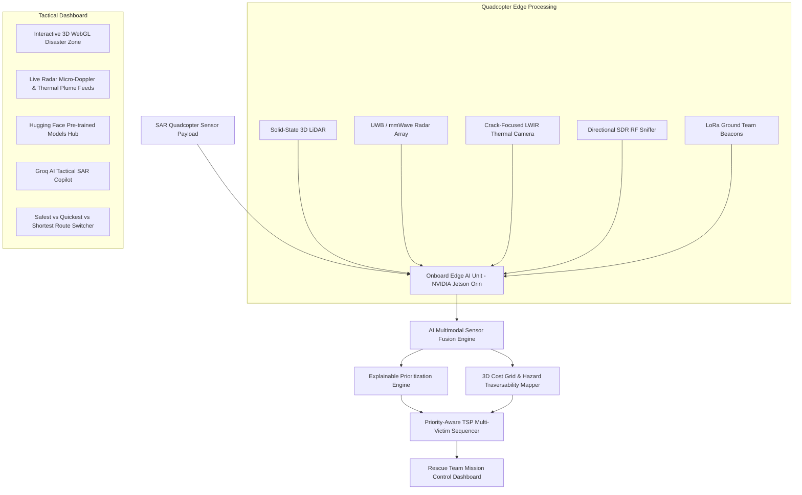

# Project TRINETRA: AI-Powered Drone Search & Rescue System
### Smart India Hackathon (SIH) Finalist Specification

> **An Edge-Capable Quadcopter Platform for Sub-Surface Victim Localization, 3D Hazard Mapping, and Risk-Aware Multi-Victim Rescue Sequencing**

[](https://vercel.com)
[](https://www.netlify.com)
[](https://huggingface.co)
[](https://groq.com)

---

## 🌟 Innovation & Uniqueness (Core Highlights)

As emphasized in our SIH presentation:
1. **Integrates 3D victim localization, hazard mapping, and multi-victim rescue planning** into a single unified situational intelligence platform.
2. **Finds the safest, shortest, and quickest rescue paths using 3D disaster analysis** through cost-grid A* pathfinding over complex rubble terrain.
3. **Uses priority-aware optimization to plan the most efficient rescue sequence for all victims**, optimizing cumulative survival probability across multiple trapped survivors.

---

## 🏗️ System Architecture



---

## 🚀 Key Modules & Capabilities

### 1. Quadcopter Aerial Survey & Telemetry
- Purpose-built for confined airspace, localized hovering, and low-altitude scanning (8–15m AGL).
- Real-time telemetry monitoring: Battery percentage and remaining flight time, RTK Fixed centimeter-level GPS, pitch/roll/yaw attitude, and LoRa mesh ground link status.
- Designed for GPS-denied environments using onboard visual-inertial odometry (VIO) and LiDAR SLAM.

### 2. 3D LiDAR Terrain & Hazard Mapping
- Dense 3D point cloud generation color-coded by elevation and terrain roughness.
- Automated identification of collapsed structures, pancake floor slabs, buckled pillars, loose rubble mounds (32° unstable slopes), and flooded trenches.
- Procedural hazard overlays:
  - **Red Zones**: High instability / active collapse hazard (tilt-slab structures).
  - **Orange Zones**: Moderate slope roughness requiring safety ropes.
  - **Green Corridors**: Surveyed cleared concrete pathways with low vibration risk.

### 3. Hidden Victim Detection (Multi-Sensor Sub-surface)
- **UWB & mmWave Radar Sensing**: Detects chest-wall micro-motion (0.2–0.5 mm) to extract respiration waveforms (breaths/min) and cardiac harmonics through rubble voids. *Adheres to realistic physical penetration limits (0.3m – 3.5m in fragmented debris; rejects naive through-solid-concrete claims).*
- **Crack-Focused Thermal Detection**: High-sensitivity LWIR sensor analyzes warm convective air plumes venting through rubble fissures and cracks rather than attempting impossible through-slab thermal transmission.
- **Digital Rescue SDR Sniffing**: Directional antenna coupled with Software Defined Radio (SDR) detects Wi-Fi probe requests, Bluetooth LE beacons, and electromagnetic clock radiation from trapped victims' smartphones and wearables.

### 4. Hugging Face Pre-trained Models Integration
The system integrates state-of-the-art pretrained models from the **Hugging Face Hub** optimized for edge deployment (ONNX / TensorRT INT8):
1. `keremberke/yolov8m-thermal-people` (Hugging Face): Thermal & RGB human heat plume detector.
2. `MIT/ast-finetuned-audioset` (Hugging Face ONNX): Audio Spectrogram Transformer (AST) for UWB radar micro-Doppler respiration classification.
3. `cardiffnlp/twitter-roberta-base-sentiment-latest` & `Xenova/distilbert-base-uncased`: Edge NLP urgency triage for sniffed digital distress probe messages.

### 5. Groq-Powered AI Tactical SAR Copilot
- Powered by ultra-fast Groq LPU inference (`qwen/qwen3.8-27b`) delivering 500+ tokens/second.
- Provides real-time tactical extraction protocols (shoring sequences, pneumatic jack positioning, oxygen tube insertion, cervical stabilization) tailored to Indian NDRF and international INSARAG guidelines.
- **Offline Fallback Guarantee**: If disaster conditions cause total communications blackout, the system seamlessly transitions to the onboard Edge AI rule-engine with zero downtime.

### 6. Explainable Victim Prioritization Engine
- Transparent multi-factor decision-support score:
  $$\text{Score} = (w_1 \cdot \text{Urgency}) + (w_2 \cdot \text{Accessibility}) + (w_3 \cdot \text{Confidence}) - (w_4 \cdot \text{Hazard})$$
- Generates clear, non-prescriptive reasoning for ground commanders with equipment checklists.

### 7. 3D Risk-Aware Route Planning & Multi-Victim Sequencer
- Evaluates 3 distinct route alternatives:
  - **Safest Route**: Circumvents hazardous tilt-slab zones via cleared corridors (Safety Grade A).
  - **Quickest Route**: Optimizes transit time over moderate rubble.
  - **Shortest Route**: Direct line with prominent hazard warnings (Safety Grade F).
- **Priority-Aware Multi-Victim Sequencer**: Solves the Traveling Salesperson Problem (TSP) weighted by medical urgency, sequencing visits to minimize mortality risk.

---

## 💻 Running the Dashboard Locally

### Option 1: Python One-Click Runner (Recommended)
No external dependencies required! Just run:
```bash
python run_dashboard.py
```
This starts an internal HTTP server on port 8000 and automatically opens your web browser to `http://localhost:8000`.

### Option 2: Any Static Web Server
```bash
# Using Python
python -m http.server 8000

# Using Node.js npx
npx serve .
```

---

## ☁️ 1-Click Cloud Deployment (Vercel & Netlify)

This project has zero build step requirements and is pre-configured with `vercel.json` and `netlify.toml`.

### Deploy to Vercel
1. Push this repository to GitHub.
2. Go to [vercel.com/new](https://vercel.com/new) and import the repository.
3. Keep default settings (Framework Preset: `Other`) and click **Deploy**.
4. Or via Vercel CLI:
   ```bash
   npm i -g vercel
   vercel deploy --prod
   ```

### Deploy to Netlify
1. Push this repository to GitHub.
2. Go to [app.netlify.com](https://app.netlify.com) and click **"Add new site"** -> **"Import an existing project"**.
3. Select your repository. Publish directory is `.` (root).
4. Click **Deploy Site**.
5. Alternatively, drag and drop this entire folder into [app.netlify.com/drop](https://app.netlify.com/drop) for instant zero-setup hosting!

---

## 👥 Smart India Hackathon (SIH) Team
- **Project Title**: AI-Powered Drone Search & Rescue System (Project TRINETRA)
- **Domain**: Disaster Management, Robotics & Defense
- **Target End-Users**: National Disaster Response Force (NDRF), State Disaster Response Forces (SDRF), Indian Armed Forces SAR Units, and Civil Defense Agencies.
